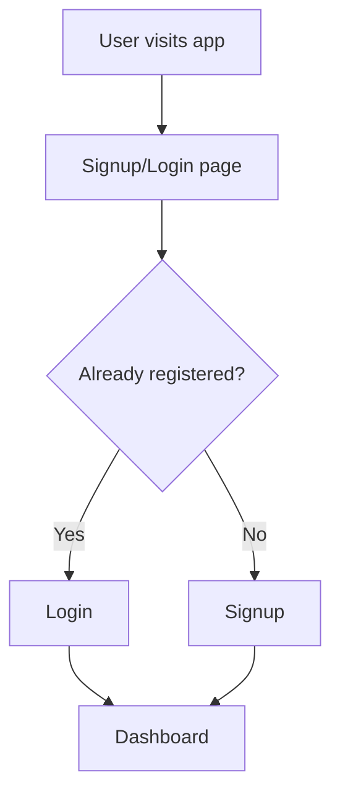
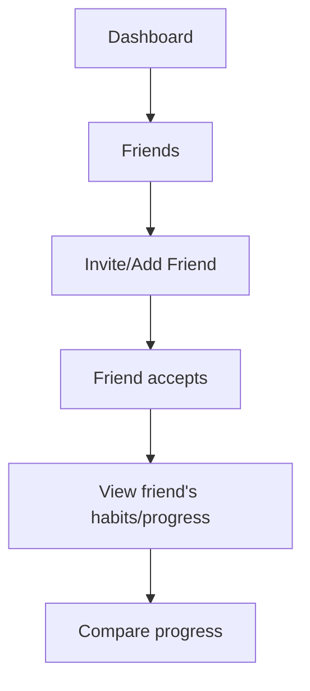
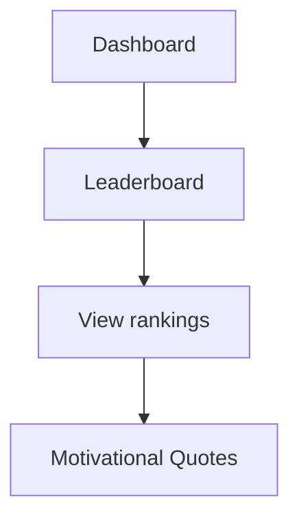

# App Flow Diagrams (Mermaid)

## User Registration & Login Flow


## Habit Management Flow
```mermaid
flowchart TD
    F[Dashboard] --> G[Add Habit]
    F --> H[View/Edit Habits]
    G --> I[Enter habit details]
    I --> J[Save habit]
    J --> H
    H --> K[Track habit (daily/weekly/monthly)]
    K --> L[Progress Visualization]
```

## Friends & Social Flow


## Leaderboard Flow


---
Yeh diagrams app ke main flows ko visualize karte hain.